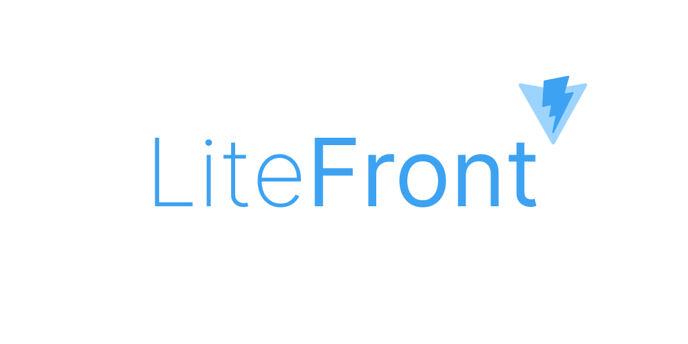

# 

[](https://biomejs.dev)
[](https://knip.dev/)


A modern, scalable, and developer-friendly frontend boilerplate powered by **Vite, React 19, GraphQL, and TypeScript**. Built with the **[Feature-Sliced Design](https://feature-sliced.design)** methodology and pre-configured **OIDC Authentication**.

## Table of Contents

- [Overview](#overview)
- [Tech Stack](#tech-stack)
- [Architecture](#architecture)
- [Key Features](#key-features)
- [Configuration](#configuration)
- [Custom Authentication](#custom-authentication)
- [Scripts Overview](#scripts-overview)
- [Perfect Pairing with LiteEnd](#perfect-pairing-with-liteend)
- [Get Started](#get-started)
- [Types Generation](#types-generation)
- [Testing](#testing)
- [Error Monitoring](#error-monitoring)
- [License](#license)
- [Contributing](#contributing)

## Overview

LiteFront is a lightweight and performant frontend boilerplate designed for building fast, efficient, and well-structured web applications. It integrates a modern toolchain to provide an exceptional developer experience (DX) right out of the box.

- **🚀 Performance**: Fast development server and optimized builds thanks to **Vite**.
- **🔒 Security**: Enterprise-grade authentication via **OpenID Connect (OIDC)**.
- **🧩 Scalability**: **Feature-Sliced Design** ensures your project stays organized and maintainable as it grows.
- **✅ Reliability**: Type-safety with **TypeScript**, code quality enforced by **Biome**, and pre-commit checks with **Lefthook**.
- **🧪 Test-Ready**: Unit testing with **Vitest** and End-to-End testing with **Playwright** are pre-configured.

## Tech Stack

| Category                 | Technology                                                                                              |
|:-------------------------|:--------------------------------------------------------------------------------------------------------|
| **Core**                 | [Vite](https://vitejs.dev), [React 19](https://react.dev), [TypeScript](https://www.typescriptlang.org) |
| **Routing**              | [TanStack Router](https://tanstack.com/router) (Type-safe)                                              |
| **Authentication**       | [react-oidc-context](https://github.com/authts/react-oidc-context) (OAuth 2.0 / OIDC)                   |
| **Data Fetching**        | [GraphQL](https://graphql.org) with [URQL Client](https://formidable.com/open-source/urql)              |
| **State Management**     | [Zustand](https://github.com/pmndrs/zustand)                                                            |
| **Styling**              | [Tailwind CSS](https://tailwindcss.com) + [SCSS Modules](https://github.com/css-modules/css-modules)    |
| **UI Components**        | [daisyUI](https://daisyui.com/) (for Tailwind CSS)                                                      |
| **Internationalization** | [Paraglide JS](https://inlang.com/m/gerre34r/library-inlang-paraglideJs) (Type-safe)                    |
| **Code Generation**      | [GraphQL Code Generator](https://the-guild.dev/graphql/codegen)                                         |
| **Linting/Formatting**   | [Biome](https://biomejs.dev), [Stylelint](https://stylelint.io), [Knip](https://knip.dev)               |
| **Git Hooks**            | [Lefthook](https://github.com/evilmartians/lefthook)                                                    |
| **Testing**              | [Vitest](https://vitest.dev) (Unit), [Playwright](https://playwright.dev) (E2E)                         |
| **Component Dev**        | [Ladle](https://ladle.dev) (Storybook alternative)                                                      |
| **Deployment**           | [Docker](https://www.docker.com) with [Caddy Server](https://caddyserver.com)                           |

## Architecture

This boilerplate uses **[Feature-Sliced Design (FSD)](https://feature-sliced.design)**, a methodology for structuring frontend applications. It helps to keep the codebase clean, scalable, and easy to navigate by organizing code into layers (`shared`, `entities`, `features`, `widgets`, `pages`, `app`).

## Key Features

- **Secure Authentication**: Fully integrated OIDC/OAuth 2.0 flow with PKCE, automatic token renewal, and `AuthGuard` for protected routes.
- **Protected Routes Example**: Includes a demo `/protected` route that requires authentication and displays user profile data.
- **🌍 Type-Safe I18n**: Built-in internationalization powered by **Paraglide JS**, offering full type safety, tree-shaking, and small bundle size.
- **Automated Type Generation**: `npm run gen` generates TypeScript types from your GraphQL schema.
- **Environment Consistency**: Custom Vite plugin ensures `.env` and `.env.example` are always in sync.
- **Production-Optimized**: Multi-stage Dockerfile for small, secure images served by the high-performance Caddy web server.
- **Image Optimization**: Automatic image optimization at build time with `vite-plugin-image-optimizer`.
- **Dead Code & Dependency Analysis**: Keeps the codebase clean with **Knip** by detecting unused files, exports, and dependencies.

## Configuration

The application requires the following environment variables to be set in `.env` for the OIDC authentication to work correctly.

| Variable                 | Description                                                  | Example                                         |
|:-------------------------|:-------------------------------------------------------------|:------------------------------------------------|
| `VITE_OIDC_AUTHORITY`    | The URL of your OIDC provider (Logto, Auth0, Keycloak, etc.) | `https://your-app.logto.app/oidc`               |
| `VITE_OIDC_CLIENT_ID`    | The Client ID of your application registered in the provider | `abc123xyz...`                                  |
| `VITE_OIDC_REDIRECT_URI` | The callback URL where the user is redirected after login    | `http://localhost:3000/callback`                |
| `VITE_OIDC_SCOPE`        | The scopes to request                                        | `openid profile offline_access`                 |
| `VITE_GRAPHQL_API_URL`   | URL of your GraphQL API                                      | `http://localhost:4000/graphql`                 |
| `PORT`                   | The port the application will run on                         | `3000`                                          |
| `VITE_SENTRY_DSN`        | The DSN key for Sentry error tracking                        | `https://xxx@yyy.ingest.sentry.io/zzz`           |
| `VITE_SENTRY_ORG`        | Sentry organization slug (used for source maps)             | `your-org`                                      |
| `VITE_SENTRY_PROJECT`    | Sentry project name (used for source maps)                    | `your-project`                                  |
| `VITE_SENTRY_AUTH_TOKEN` | Build-time token for uploading source maps                   | `sntrys_...`                                    |

## Custom Authentication

This boilerplate uses a facade pattern for authentication located in `src/features/auth`. This architecture decouples the application from the specific OIDC library, allowing you to replace it with any other method (e.g., custom JWT/Session based auth) easily.

To replace OIDC with your own logic:

1. Open `src/features/auth/index.ts`.
2. Remove `react-oidc-context` exports.
3. Implement and export your own `AuthProvider` component and `useAuth` hook from this file.
4. Update `src/app/providers/...` (or `src/main.tsx` if providers are there) to remove `oidcConfig` injection if your new provider doesn't need it.

## Scripts Overview

- `npm run start:dev`: Starts the development server with Hot Module Replacement.
- `npm run build`: Bundles the application for production.
- `npm run test:prod`: Runs all unit and end-to-end tests.
- `npm run check`: Runs all code quality checks (linting, type-checking, Knip).
- `npm run gen`: Generates TypeScript types for GraphQL operations.

## Perfect Pairing with [LiteEnd](https://github.com/uxname/liteend)

This LiteFront boilerplate is best suited for use with [LiteEnd](https://github.com/uxname/liteend), as they are
designed to work seamlessly together. LiteEnd provides a backend that integrates smoothly with LiteFront via GraphQL and
TypeScript, enabling a cohesive full-stack development experience.

## Get Started

### One-Liner

```bash
npx degit uxname/litefront my-app && cd my-app && git init && git add . && git commit -m "Initial commit" && npm install && cp .env.example .env && npm run gen && npm run start:dev
```

### Step-by-Step

1. **Clone the repository**

    ```bash
    npx degit uxname/litefront my-app
    cd my-app
    ```

2. **Initialize Git**

    ```bash
    git init && git add . && git commit -m "Initial commit"
    ```

3. **Install dependencies**

    ```bash
    npm install
    ```

4. **Setup environment variables**

    ```bash
    cp .env.example .env
    ```

    **Important:** Open `.env` and fill in your OIDC provider details (`VITE_OIDC_AUTHORITY`, `VITE_OIDC_CLIENT_ID`, etc.) or the app will not be able to authenticate users.

5. **Generate GraphQL types**

    ```bash
    npm run gen
    ```

6. **Run the development server**

    ```bash
    npm run start:dev
    ```

Your app should now be running on the port specified in your `.env` file (default: `http://localhost:3000`).

## Types Generation

Run `npm run gen` after every change to the GraphQL API Schema or after modifying any `*.graphql` files in the `src/graphql` directory. This command is crucial for maintaining type safety between your frontend and backend.

## Testing

This boilerplate includes a complete testing infrastructure for both unit and end-to-end testing.

- **Unit/Component Tests**: Written with **Vitest** and **Testing Library** for testing React components and Zustand stores.
- **E2E Tests**: Run on **Playwright** with pre-configured **Mock Auth** — allows stable test runs without requiring a real OIDC provider.

### Unit Tests
```bash
npm run test:prod
```

### E2E Tests
```bash
# Run in headless mode
npm run test:e2e:prod

# Run with UI
npm run test:e2e:dev
```

### Coverage
```bash
npm run test:coverage
```

## Error Monitoring

This application uses **Sentry** for production error tracking and performance monitoring. The integration includes automatic source map uploading during the build process via `@sentry/vite-plugin`.

To enable Sentry, configure the following environment variables:
```env
VITE_SENTRY_DSN=your-sentry-dsn
VITE_SENTRY_ORG=your-sentry-org
VITE_SENTRY_PROJECT=your-sentry-project
VITE_SENTRY_AUTH_TOKEN=your-auth-token # Required only at build time
```

*(Note: `VITE_SENTRY_AUTH_TOKEN` should be kept secret and configured in your CI/CD pipeline, not committed to the repository).*

## License

LiteFront is licensed under the MIT License.

## Contributing

Contributions are welcome! Please feel free to open an issue or submit a pull request with your changes.
